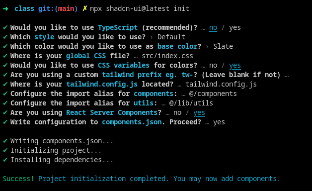
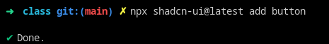
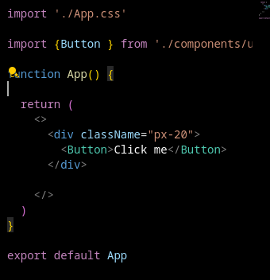

# Process

## Installing Vite and Shadcdn

Follow this : [YT link](https://www.youtube.com/watch?v=gXSC5eMw68o)

The official shacdn doc has the the steps for ts + vite + shacdn [Link](https://ui.shadcn.com/docs/installation/vite)

In step 3 instead pf creating tsconfig.json, create jsconfig.json

```json
{
  "compilerOptions": {
    "baseUrl": ".",
    "paths": {
      "/*": ["./*"]
    }
  }
}

```








